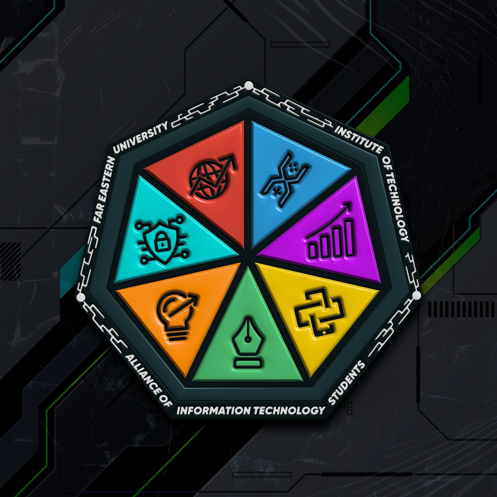
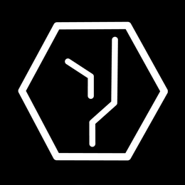

<a name="readme-top">

<br/>

<br />
<div align="center">
  <a href="">
    
  </a>
  <h3 align="center">Boilerplate for Tauri, NextJS & ShadCN</h3>
</div>
<!-- Complete this-->
<div align="center">
    A starter template for building cross-platform desktop applications using Tauri, NextJS & ShadCN.
</div>

<br />

---

<br />
<br />

<details>
  <summary>Table of Contents</summary>
  <ol>
    <li>
      <a href="#overview">Overview</a>
      <ol>
        <li>
          <a href="#key-components">Key Components</a>
        </li>
        <li>
          <a href="#technology">Technology</a>
        </li>
      </ol>
    </li>
    <li>
      <a href="#use-as-template">Use as Template</a>
    </li>
    <li>
      <a href="#installation">Installation</a>
    </li>
    <li>
      <a href="#contributor-list">Contributor List</a>
    </li>
  </ol>
</details>

---

## Overview

This project provides a boilerplate for developing cross-platform desktop applications using Tauri, NextJS, and ShadCN. The purpose of this boilerplate is to offer a robust starting point that incorporates modern web development technologies, enabling developers to quickly create responsive and efficient desktop applications.

### Key Components
- Develop Windows/Mac/Linux Applications: Utilize Tauri to create cross-platform desktop applications.
- Utilize Web Development: Leverage the power of NextJS for fast and efficient web development.
- Utilize Fast Design Framework: Implement ShadCN for a streamlined and cohesive UI design experience.

### Technology
- 
- 
- 

Framework for Desktop
- 

Web Framework
- 

Design Framework
- 
- 

## Use as Template
To use this project as a template, simply click the "Use this template" button on the GitHub repository page. This will create a new repository with the same directory structure and files. 

[Guide](https://scribehow.com/shared/Create_Repository_Based_on_Template_on_GitHub__uqrFu1o3T3iETD9bBMGFlQ?referrer=workspace)

## Installation
Follow these steps to set up and run the project:

> Note: make sure you install NodeJS and Rust. if not follow [here](https://github.com/zyx-0314/tauri-next-shadcn-template/wiki/Initialization-of-project).
> 
> Note: Make sure you are working under your directory files and using cmd/powershell/bash

1. Install Dependencies
```sh
# for npm
npm install

# for bun
bun install

# for yarn
yarn install
```

2. Start the development server
```sh
# For npm
npm run dev

# for bun
bun dev

# For yarn
yarn run dev
```

3. Package the application: Universal (optional)
```sh
# For npm
npm run build

# for bun
bun build

# For yarn
yarn run build
```
   1. For Windows only
```sh
# For npm
npm run build:win

# for bun
bun build:win

# For yarn
yarn run build:win
```
   2. For Linux only
```sh
# For npm
npm run build:linux

# for bun
bun build:linux

# For yarn
yarn run build:linux
```
   3. For Mac only
```sh
# For npm
npm run build:mac

# for bun
bun build:mac

# For yarn
yarn run build:mac
```

4. Preview the Application (optional, will only work with build)
```sh
# For npm
npm run start

# for bun
bun start

# For yarn
yarn run start
```

## Contributor List
<a href="https://github.com/zyx-0314">
  
</a>
<a href="https://github.com/Hadeslokiama">
  
</a>
